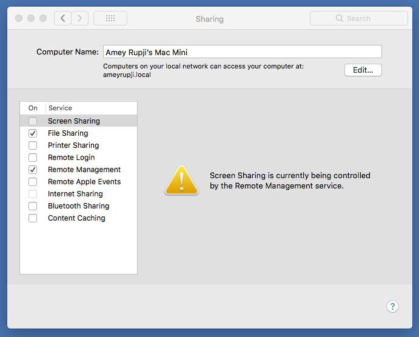
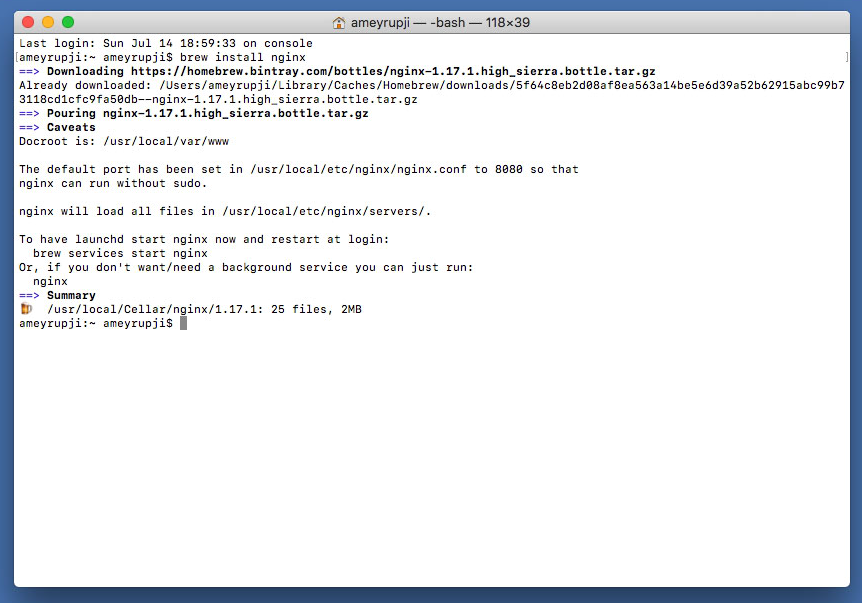
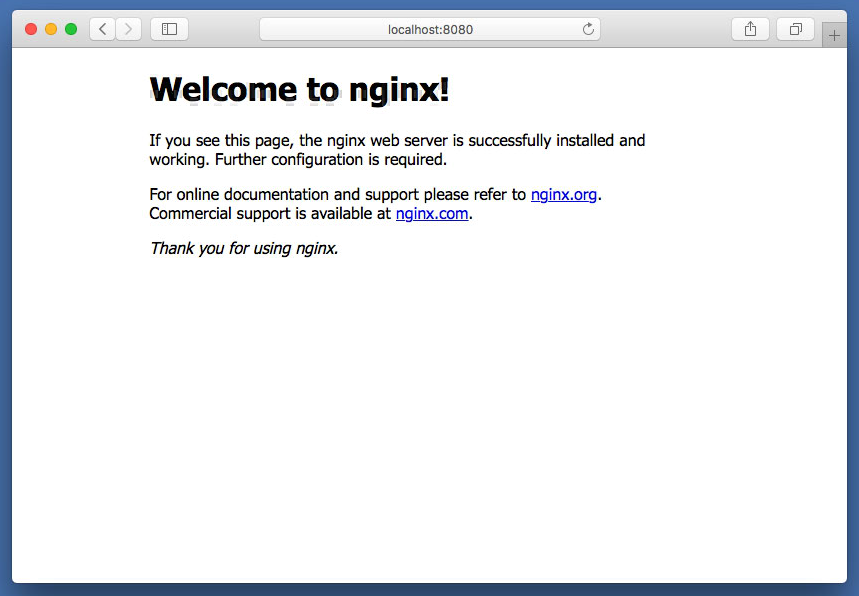
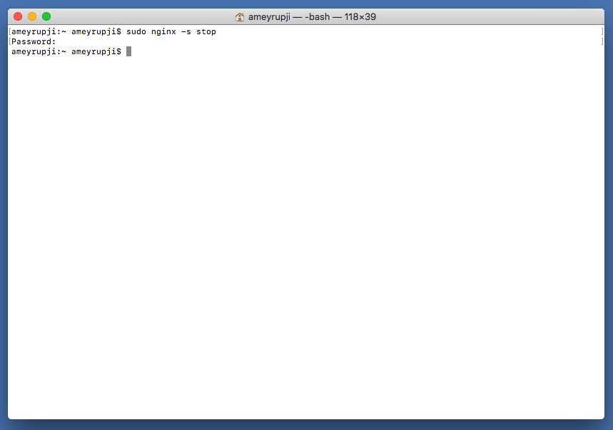
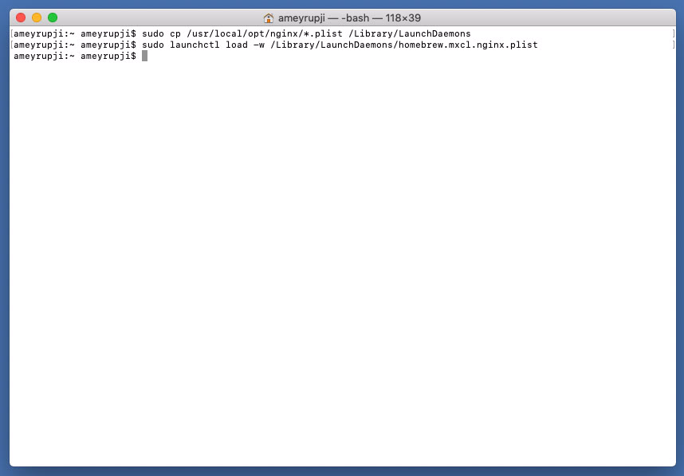
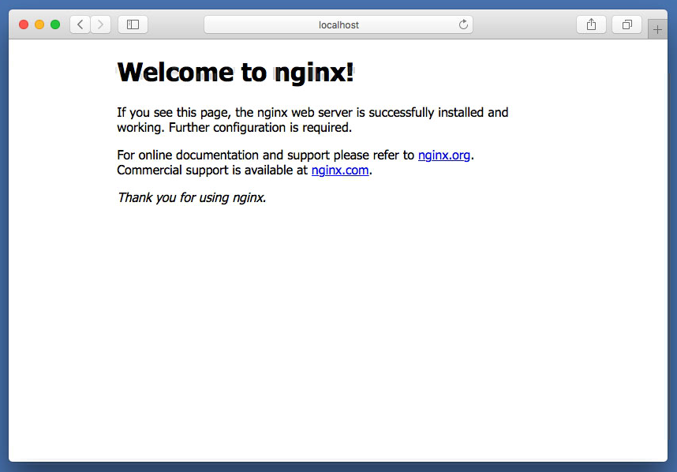
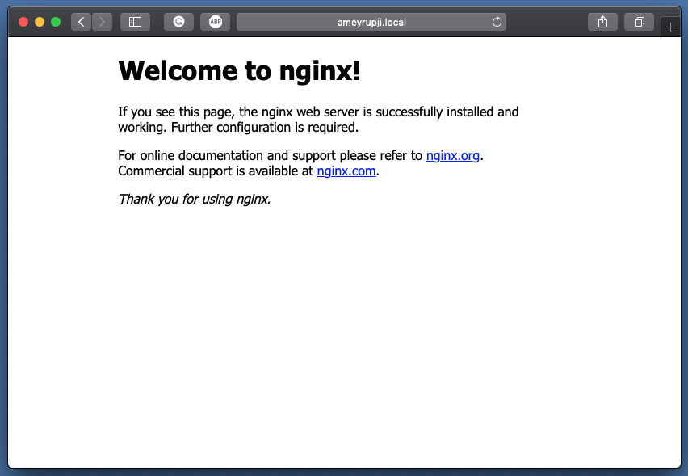

# ameyrupj.local-nginx-setup

This repository outlines the steps to setup nginx on MacOS to act as a reverse proxy for various apps deployed on my local server.

## Prerequisites 

- HomeBrew installed (Installation instructions: https://www.howtogeek.com/211541/homebrew-for-os-x-easily-installs-desktop-apps-and-terminal-utilities/)

## System Configuration at time of test

- macOS High Sierra - Version 10.13.6 
- Sharing > Local Hostname set to `ameyrupji.local` 

## Installation instructions

### Brew install

These instructions are used to install nginx using brew

Use brew to install the nginx run the following command in a terminal: `brew install nginx`

To start nginx server run in terminal: `sudo nginx`

To check that the services is started use this command `brew services list`



Nginx is installed on port 8080 by default. Open Safari and going to URL: `http://localhost:8080`

Nginx is now installed!




### Changing the default port to 80

The default place of nginx.conf on Mac after installing with brew is:
`/usr/local/etc/nginx/nginx.conf`

Changing the default port to 80. First stop the nginx server if it is running by using the following commands:
`sudo nginx -s stop`



Then open nginx.conf with vim in terminal:
`vim /usr/local/etc/nginx/nginx.conf`

and change the:

```
http {
    ...

    server {
        listen       8080;
        server_name  localhost;

        ...
```

to:

```
http {
    ...

    server {
        listen       80;
        server_name  localhost;

        ...
```

Save configuration and relaunch nginx
`sudo nginx`

### Enable nginx auto start on reboot

Before the testing can begin lets setup Nginx to autostart on reboot. Use the following commands to enable this: `sudo cp /usr/local/opt/nginx/*.plist /Library/LaunchDaemons` and 
`sudo launchctl load -w /Library/LaunchDaemons/homebrew.mxcl.nginx.plist`



## Test 

Open Safari it by going to URL:
`http://localhost`



This website should also be accessible over the network from another computer at `http://ameyrupji.local/`




## Cleanup

To uninstall nginx:

First stop the nginx server if it is running by:
`sudo nginx -s stop`

Using brew to uninstall Nginx run the command: 
`brew uninstall nginx`

Remove Nginx code by running the following commands:
`rm -f -R /usr/local/nginx` and `rm -f /usr/local/sbin/nginx`


## Useful Links

- https://medium.com/@ThomasTan/installing-nginx-in-mac-os-x-maverick-with-homebrew-d8867b7e8a5a
- https://derickbailey.com/2014/12/27/how-to-start-nginx-on-port-80-at-mac-osx-boot-up-log-in/
- https://github.com/jenkinsci/pipeline-examples
